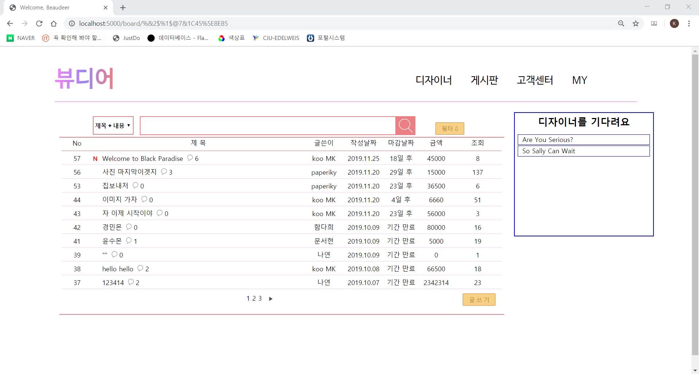
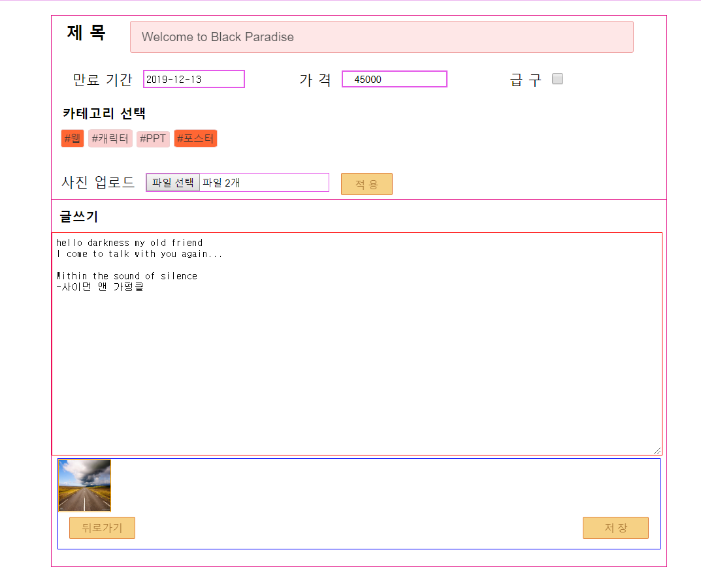
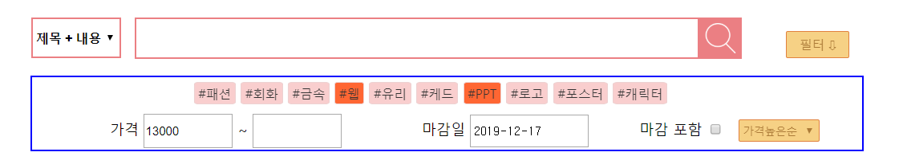
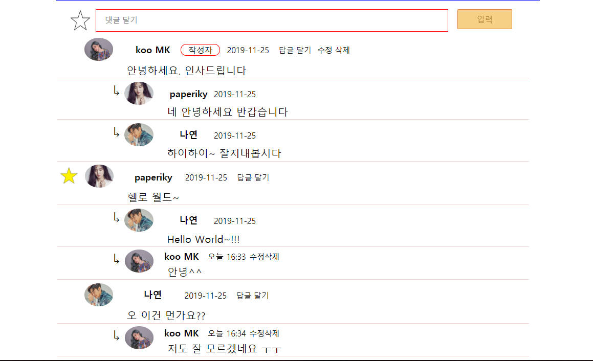
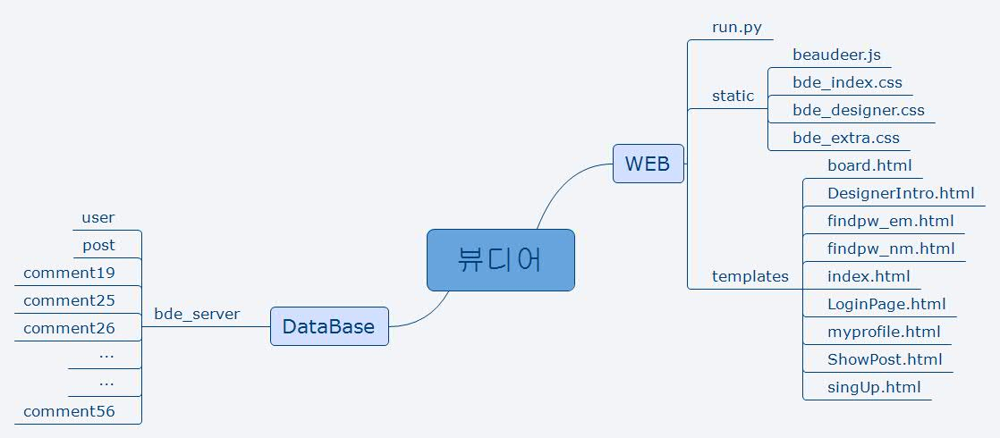

# bewdeer
## Design trading platform for University student

### 📢 Notice ❗
Python을 처음 배우던 시절...     
Flask를 처음 배우고 시작한 프로젝트이기에 코드가 매우 매우 더럽습니다.    

***

📌 Name : 뷰디어 / Bewdeer

📌 Authors : [Minku Koo](https://github.com/Minku-Koo)      

📌 Development Period : Sep.2019 ~ Dec.2019     

📌 Framework : Flask     

📌 Database : MySQL     

## 🖥 User Interface

### ✔ 메인 화면
</img>

### ✔ 게시판 화면
</img>

### ✔ 글쓰기 화면
</img>

### ✔ 게시글 검색 필터
</img>

### ✔ 댓글 및 답글
</img>

## 📋 WBS
</img>

